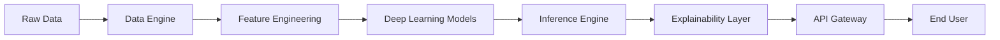

# Lumina: Advanced Predictive Analytics & Anomaly Detection

[](https://www.python.org/downloads/)
[](https://pytorch.org/)
[-orange.svg)](#)
[](#)

**Lumina** is a comprehensive, production-ready framework for building high-performance predictive models and detecting anomalies in complex data streams. It leverages deep learning architectures (Transformers, LSTMs) and integrates model explainability to ensure transparent AI decision-making.

## 🌟 Key Features

- **Predictive Modeling:** Advanced time-series forecasting using Transformer-based architectures.
- **Anomaly Detection:** Real-time outlier detection in multivariate data streams.
- **Explainable AI (XAI):** Built-in SHAP and LIME integration for model interpretability.
- **Scalable Data Processing:** Efficient data pipelines with PyTorch DataLoaders.
- **Production-Ready API:** High-throughput FastAPI backend for inference.
- **Automated MLOps:** Integrated model versioning and CI/CD pipelines.

## 🏗️ Architecture



## 🛠️ Tech Stack

- **Core:** Python, PyTorch, Scikit-Learn.
- **Explainability:** SHAP, LIME.
- **Web:** FastAPI, Uvicorn, Pydantic v2.
- **Deployment:** Docker, GitHub Actions, MLflow.

## 📥 Getting Started

### Prerequisites
- Python 3.10+
- Docker

### Installation
1. Clone the repository:
   ```bash
   git clone https://github.com/GoncaloNobre21/Lumina-Predictive-Analytics.git
   cd Lumina-Predictive-Analytics
   ```

2. Setup environment:
   ```bash
   pip install -r requirements.txt
   ```

3. Run the API:
   ```bash
   uvicorn src.api.main:app --reload
   ```

## 🧪 Testing
```bash
pytest tests/
```

## 📜 License
This project is licensed under the MIT License - see the [LICENSE](LICENSE) file for details.
